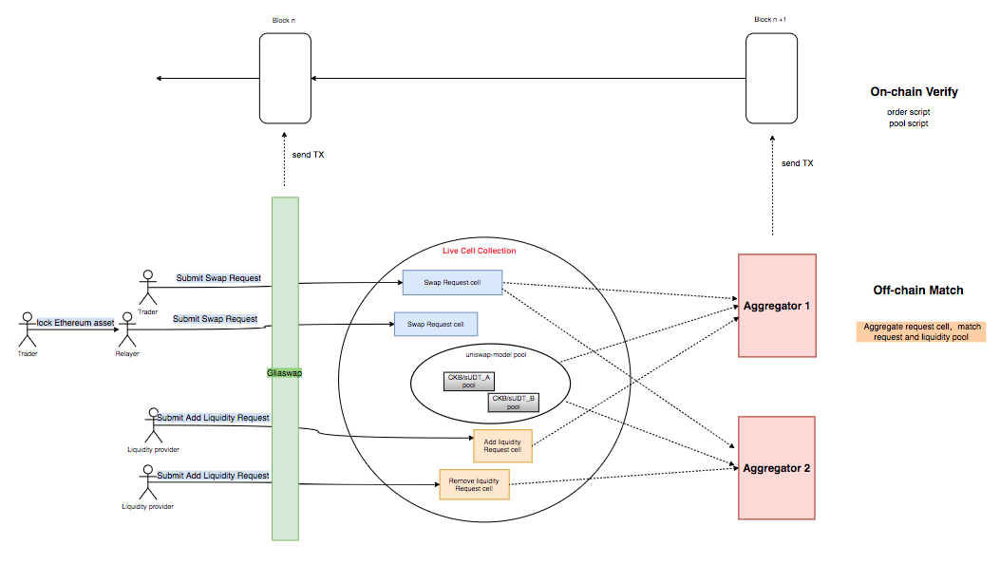

## Network Actors

### Trader

Trader is the entity who wants to swap one token to another token. 

* To make a swap between CKB and sUDT, traders need to submit a swap request firstly, and then Aggregators will help them to finish the swap. Traders also have the option to cancel their submitted swap request. 

```text
        submit swap request             match request with pool
Traders ------------------> Aggragators -----------------------> On-chain Verify
                                               off-chain 
```

* If this is a cross-chain swap, for example, using ETH to buy CKB, traders need to submit a tx to lock their ETH firstly, cross-chain relayer will help user to submit the swap request, and then Aggregators will help them to finish the swap. 

```text
        lock ETH          submit swap request             match request with pool
Traders --------> Relayer ------------------> Aggragators -----------------------> On-chain Verify
                                                              off-chain 
```

* Gliaswap also support user to cross their Ethereum asset to Nervos or cross back. User only need to sign one tx to lock their assets or burn their assets, relayer will help them finish all the rest operation.

```text
        lock ETH            mint ckETH for Alice         
Alice -----------> Relayer -----------------------> Nervos On-chain Verify
                                 off-chain 
```

```text
       burn ckETH            unlock ETH for David         
David -----------> Relayer -----------------------> Ethereum Excute
                                  
```

* The user experience in UI are quite simple, just sign one transaction to make a swap. 

### Liquidity Provider

Liquidity provider is the entity that contributes liquidity for this network. The liquidity provider can be any entity including individual users, traditional market maker, or some decentralized fund. Liquidity providers take on price risk and are compensated with fees.

* To add liquidity or remove liquidity, LPs need to submit a liquidity request firstly, and then Aggregators will help them to finish the operation. In first version, we only support sUDT/CKB pool. LPs also have the option to cancel their submitted liquidity request.

```text
    submit swap request             match request with pool
Lps ------------------> Aggragators -----------------------> On-chain Verify
                                          off-chain 
```

### Aggregator

Aggregators are the entity that help to match requests and pools. Working as the “system executors,” aggregators retrieve the request cells and the pool cells on chain and then compete to match them off-chain and submit matching transactions. There are three types of work from which aggregators can gain profit.

* By matching swap request cell with pool cell, aggregators can get the tip fee from each swap request cell they matched. 
* By matching liquidity request cell with pool cell, aggregators can get the tip fee from each liquidity request cell they matched.

Anyone can become a Gliaswap aggregator and begin earning fees for every trade they facilitate. The winner in the race will get the trading commissions claimed in the order. However, the other aggregators don’t suffer any losses, since CKB won’t charge any fees for failed transactions.

### Cross-chain Relayer

The cross-chain relayer are responsible for transfer the message between Ethereum and Nervos and help user to cross chain. More cross-chain related info, please check [Force Bridge docs](https://github.com/nervosnetwork/force-bridge-eth).

## AMM Algorithm

Gliaswap is able to adopt many types of AMM algorithm to support different pool model. In the first version, we adopt uniswap AMM Algorithm as a special pool type. In this model, prices are set automatically using the constant product market maker mechanism, which keeps overall reserves in relative equilibrium. Anyone can become a liquidity provider for a pool by depositing an equivalent value of each underlying token in return for pool tokens. These tokens track pro-rata LP shares of the total reserves, and can be redeemed for the underlying assets at any time. For more explanation, you can check this [docs](https://hackmd.io/@HaydenAdams/HJ9jLsfTz?type=view).

:::note

* Although the AMM Algorithm is same with Uniswap, the mechanism have a big difference. More specifically, if a user want to add liquidity, firstly, he need to make a ‘add liquidity‘ request by creating a request cell containing request info and pool info，and then aggregator will match this request with pool once their price get matched. 
